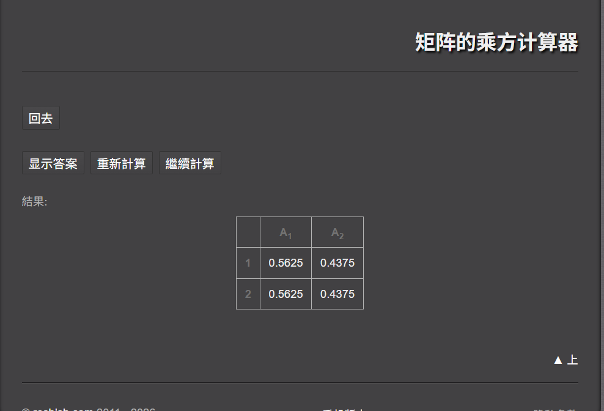

# 前言

不断学习机器学习和神经网络的过程中我发现确实了一个最关键的部分，决策部分被我忽略了。我整理了一下主流的决策数学原理有

1. 马尔科夫链
2. 马尔科夫奖励过程 MRP
3. 马尔科夫决策过程 MDP
4. 贝尔曼方程
5. 贝尔曼最优方程

接下来我将逐一的学习这些理论基础，并用一个个实践项目来加深自己的理解。

# 马尔科夫链

## 什么是马尔科夫链

马尔科夫链的思想：**过去所有的信息都已经被保存到了现在的状态，基于现在就可以预测未来。**

在生活中的例子是用于预测天气的变化，例如今天是晴天，明天是晴天的概率为A，阴天为B，今天是阴天，明天是晴天的概率为C，阴天为D。如果要预测2天后是晴天、阴天的概率是多少？这个就算马尔科夫链的一个简单应用了。其中晴天阴天称为**状态，**为此我们引出**状态转移概率矩阵**

## 状态转移概率矩阵

现在我们使用**状态转移概率矩阵**来解决上面提出的问题

$$
\begin{array}{|c|c|c|}
\hline
 & \text{晴天} & \text{阴天} \\
\hline
\text{晴天} & 0.3 & 0.7 \\
\hline
\text{阴天} & 0.9 & 0.1 \\
\hline
\end{array}
$$
我们假设得到这样子的一个矩阵，接下来我们我们计算2天后的可能性

$$
\begin{align*}
P &= \left(\begin{array}{ccc}
 & A & B \\
A & 0.3 & 0.7 \\
B & 0.9 & 0.1
\end{array}\right)
\left(\begin{array}{ccc}
 & A & B \\
A & 0.3 & 0.7 \\
B & 0.9 & 0.1
\end{array}\right) \\
&= \left(\begin{array}{ccc}
 & A & B \\
A & 0.3\times0.3 + 0.7\times0.9 & 0.3\times0.7 + 0.7\times0.1 \\
B & 0.9\times0.3 + 0.1\times0.9 & 0.9\times0.7 + 0.1\times0.1
\end{array}\right) \\
&= \left(\begin{array}{ccc}
 & A & B \\
A & 0.72 & 0.28 \\
B & 0.36 & 0.64
\end{array}\right)
\end{align*}
$$
这样子我们就能得到2天后所有天气的可能性了，同理我们能计算n天后的概率，我们就能通过这种方式最终决策2天后要不要带伞出门。

## 状态分布向量

如果我们需要预测今天是晴天2天后晴天和阴天的概率是多少？

$$
\pi_0 = \begin{pmatrix} 1 \\ 0 \end{pmatrix}
$$
我们先得出状态分布向量，这个向量意味着当前是晴天。

$$
\begin{align*}
P  &=
\left(\begin{array}{ccc}
 & A & B \\
A & 0.3 & 0.7 \\
B & 0.9 & 0.1
\end{array}\right)
\left(\begin{array}{ccc}
 & A & B \\
A & 0.3 & 0.7 \\
B & 0.9 & 0.1
\end{array}\right)
\begin{pmatrix} 1 \\ 0 \end{pmatrix} \\
&=
\left(\begin{array}{ccc}
 & A & B \\
A & 0.3\times0.3 + 0.7\times0.9 & 0.3\times0.7 + 0.7\times0.1 \\
B & 0.9\times0.3 + 0.1\times0.9 & 0.9\times0.7 + 0.1\times0.1
\end{array}\right)
\begin{pmatrix} 1 \\ 0 \end{pmatrix} \\
&=
\left(\begin{array}{ccc}
 & A & B \\
A & 0.72 & 0.28 \\
B & 0.36 & 0.64
\end{array}\right)
\begin{pmatrix} 1 \\ 0 \end{pmatrix} \\
&=
\begin{pmatrix}
0.72 \times 1 + 0.28 \times 0 \\
0.36 \times 1 + 0.64 \times 0
\end{pmatrix} \\
&=
\begin{pmatrix}
0.72 \\
0.36
\end{pmatrix}
\end{align*}
$$
这样子计算最终就能得出如果当前是晴天两天后的天气情况了

## 稳态分布

马尔可夫链最重要的特性之一：经过足够多步后，状态分布会收敛到一个固定值，不再变化。

$$
\text{稳态分布 } \pi \text{ 满足：} \pi = P \times \pi
$$
以上面的为例子

$$
\boldsymbol{\pi} = \begin{bmatrix} x \\ y \end{bmatrix}
$$
假设状态分布向量为π

$$
P = \begin{bmatrix} 0.3 & 0.7 \\ 0.9 & 0.1 \end{bmatrix}
$$
状态转移概率矩阵为P

$$
\boldsymbol{\pi} = P \boldsymbol{\pi} 展开为线性方程组：
\boldsymbol{\pi} = P \boldsymbol{\pi} \implies \begin{cases}
0.3x + 0.7y = x \\
0.9x + 0.1y = y \\
x + y = 1

\end{cases}
$$
最终计算这个线性方程组可以得到状态分布会收敛与一个固定的值

$$
 \boldsymbol{\begin{cases} x = 0.5 \\ y = 0.5 \end{cases}}
$$
解得最终会均匀的分布为0.5和0.5

用计算机算99次方后可以发现是逐渐接近0.5的

# 马尔科夫奖励过程

马尔可夫奖励过程MRP是**马尔科夫链**的自然延伸，在马尔可夫链的"状态"和"转移"基础上，引入了**收益**的概念，MRP比马尔科夫链多了**奖励函数 R**。

$$
R = \begin{cases}
1, & \text{晴天} \\
0, & \text{阴天}
\end{cases}
$$
沿用上文的例子我们设置**奖励函数 R**

## 回报

引入了奖励的概念，接下来我们就需要考虑是从一个状态出发到另一个状态，我能获得的长期总收益是多少？这个总收益称为 **回报**。

假设天气的变化是：晴天 -> 阴天 -> 晴天 -> 晴天 -> ...

对应的奖励序列是：+1, 0, +1, +1, ...

可以发现如果这样子计算，它是不收敛的趋于无穷，那么我们引入再引入**折扣因子 γ**介于0到1之间，假设为0.9。

$$
G = 1 + 0.9 \times 0 + 0.9^2 \times 1 + 0.9^3 \times 1 + \cdots = 1 + 0 + 0.81 + 0.729 + \cdots \approx 2.54
$$
这样子我们就能得到从某一个状态出发到另一个状态我能获取**回报**就可以计算出来了，并且是收敛的，其中γ的含义就变成了关注短期收益还是长期收益。

## 状态的价值

上面的回报是一个状态到另一个状态的回报，如果我们只知道起点不知道终点我们又该如何计算？

假设我们从一个状态出发，最终会到无数个状态，每一个状态都对应了一个回报，那我们如何衡量当前这个状态的价值？

为此我们引入一个**状态价值函数 V(s)** ：从状态s出发，所能获得的所有可能回报G的平均值（期望值）。

## 状态价值函数

直接计算"所有可能路径回报的平均值"非常困难，因为路径是无限多的。那状态价值函数又该如何计算？可以利用递归的思想

从晴天开始获得的总回报 = 晴天给的即时奖励(+1) + 折扣后的从**下一个状态**开始获得的未来总回报的平均值

由此我们就得到了一个公式。

$$
V(\text{晴天}) = R(\text{晴天}) + \gamma \big[ P(\text{晴天}|\text{晴天}) V(\text{晴天}) + P(\text{阴天}|\text{晴天}) V(\text{阴天}) \big]
$$
这个公式就算对上面递归思想的直观表达.

晴天所能获得的总收益=晴天获得的及时奖励+[第二天是晴天的概率乘V(晴天)+第二天是阴天的概率乘V(阴天)]*折扣因子

对应阴天也是如此，上面就是**贝尔曼方程**了，这样子一步步扎实的理解比之前直接用QLearning理解好很多很多。

$$
\begin{cases}
V(\text{晴天}) = 1 + 0.9 \bigl( 0.3 V(\text{晴天}) + 0.7 V(\text{阴天}) \bigr) \\
V(\text{阴天}) = 0 + 0.9 \bigl( 0.9 V(\text{晴天}) + 0.1 V(\text{阴天}) \bigr)
\end{cases}
$$
由此我们就得到了一个方程组。

$$
\boxed{V(\text{晴天})=\dfrac{65}{11},\quad V(\text{阴天})=\dfrac{405}{77}}
$$
最终可以解得。这样我们就求出了处在晴天和阴天的价值，也就意味着在晴天的回报比阴天大。

# 马尔可夫决策过程

马尔可夫决策过程MDP在于引入了 **动作**，MDP在MRP的基础上，增加了**动作集 A**。我们将继续沿用上述的例子，并引入形式化定义如下

状态集 S：{晴天， 阴天}

动作集 A：{打伞， 不打伞}

状态转移概率 P：P(s' | s, a),从状态s转移到状态s'的概率，取决于在状态s下采取的动作a。

奖励函数R： R(s, a, s'),获得的即时奖励，取决于当前状态s、采取的动作a、以及到达的下一个状态s'

折扣因子 γ：0.9

## 转移概率 P

在晴天时：若选择**不打伞**，明天晴天的概率为0.3，阴天的概率为0.7

在晴天时：若选择**打伞**，明天晴天的概率为0.8，阴天的概率为0.2

在阴天时：若选择**不打伞**，明天晴天的概率为0.3，阴天的概率为0.7

在阴天时：若选择**打伞**，明天晴天的概率为0.8，阴天的概率为0.2

## 奖励函数 R

晴天选择打伞时：1-0.2

晴天选择不打伞时：1-0

阴天选择打伞时：0-0.2

阴天选择不打伞时：0-0

## 策略

在MDP中，因为有了动作，我们需要一个规则来告诉我们在每个状态下**应该做什么**。这个规则就是 **策略**。

**策略 π(a | s)**：在**状态s**下，选择**动作a**的**概率**。

我们的终极目标就是找到一个**最优策略**，使得长期回报最大化。

当策略固定时MDP就退化为一个MRP，例如，如果我们固定策略为"永远不打伞"，那么状态转移概率就变回了您文档中最初的MRP矩阵，奖励也只和状态相关。

为了找到最优策略我们需要引入一个概念**状态价值函数**

## 状态价值函数

$$
状态价值函数 V_π(s)：在遵循策略π的前提下，从状态s出发，能获得的期望回报。
$$

有点类似MRP中的状态价值函数，但是当时没有加上策略，接下来改如何计算这个函数？

假设我们的策略是：晴天不打伞，阴天打伞。现在我们需要计算V_π(晴天)，同样的我们依然能使用递归的思想去计算。

$$
V_{\pi}(晴天)=[0.3(1+0.9V_{\pi}(晴天))]+[0.7(0+0.9V_{\pi}(阴天))]
$$
当前选择晴天打伞，则明天是晴天的概率为0.3，阴天的概率为0.7。而明天是晴天又能获取+1的奖励和折扣后的V\_π(晴天)，若明天是阴天又能获取+0的奖励和折扣后的V\_π(阴天)。

$$
V_{\pi}(阴天)=[0.8(0.8+0.9V_{\pi}(晴天))]+[0.2(0.2+0.9V_{\pi}(阴天))]
$$
同理也能写出V\_π(阴天)，当前的策略是阴天打伞，这样子我们就能计算出状态的价值函数，上面这个方程就是**贝尔曼期望方程**了。

$$
\begin{aligned}
V_{\pi}(\text{晴天}) &= \frac{3372}{725}  \\
V_{\pi}(\text{阴天}) &= \frac{3562}{725}
\end{aligned}
$$
最终可以解出来，我们当前这个策略的价值。接下来我们需要使用计算出来的价值进行决策，但在此之前还需要引入一个改进策略的方法，不断的改进策略才能不断接近最优。

## 动作价值函数

V\_π(s)告诉我们"在状态s下，遵循策略π有多好"。但要**改进**策略我们需要引入一个新的函数，动作价值函数 Q\_π(s, a)。

**动作价值函数 Q\_π(s, a)**：在状态s下，**单独执行一次动作a**，之后的所有步骤都遵循策略π，所能获得的期望回报。

Q函数评估的是一次"假设性试验"。如果我这次选择做了动作a，但之后又回到策略π，总收益会怎样？

同样我们还是计算贝尔曼方程，也就是当前奖励+未来收益

$$
Q_{\pi}(晴天,打伞)=R(晴天, 打伞)+γ[0.8V_{\pi}(\text{晴天}))+0.2V_{\pi}(\text{阴天})]
$$
这个的含义就是，我突然想试试晴天打伞，以后还是按照晴天不打伞，阴天打伞的策略，最终的收益。

$$
Q_{\pi}(晴天,打伞)≈0.8 + 0.9 * [0.8 * 4.65 + 0.2 * 4.91]\\ ≈ 0.8 + 0.9 * [3.72 + 0.982]\\ ≈ 0.8 + 0.9 * 4.702 ≈ 0.8 + 4.232 ≈ 5.032
$$
最终我们就能求出在某一状态下如果我换一个选择会怎么样，通过这种方式去改进策略。

## 最优策略与贝尔曼最优方程

Q函数能指导我们改进策略，那么改进的终点就是**最优策略π***。有了最优策略自然而然会有如下的值

V*(s): 所有可能策略中，能从状态s获得的最大期望回报。

Q*(s, a): 所有可能策略中，在状态s下执行动作a能获得的最大期望回报。

最优策略π*：所有可选的行动，选那个未来总收益最高的行动。

由此我们就能推导出**贝尔曼最优方程**，也就说选择未来收益最高的行动。
$$
Q^*(晴天,打伞)=R(晴天, 打伞)+0.9[P(晴天|晴天,打伞)\times \\max(Q*(晴天,打伞), Q*(晴天,不打伞))+ P(阴天|晴天,打伞)\times \\max(Q*(阴天,打伞), Q*(阴天,不打伞))]
$$
这个方程的含义是当前的最佳策略为，当前的奖励加上折扣后未来所有可能的最大奖励。上面这个方程还能改成V版的，因为V也涉及到了动作，一样可以采用贝尔曼方程和递归的思想。

# 总结

通过上面这个例子，就将决策的数学原理进行了串联。

马尔科夫链描述了未来所有可能性的概率分布

马尔科夫奖励过程引入了回报的概念，每种状态发送后我们所能获得的回报，并通过贝尔曼方程求出我们所能获得的最大回报。

马尔可夫决策过程引入了动作的概念，当我们确定了一种策略后即可退化回马尔可夫奖励过程从而利用贝尔曼方程求出改策略下的最大回报。

而我们的策略是一组的，再将每一组情况下的选择所引起的概率变化加入到MRP中，即可推导出贝尔曼期望方程，从而计算出我们当前策略的回报。但我们需要往最优方向靠近，引入动作价值函数即可计算出当前状态下进行选择的回报。

当我们能求动作价值函数时，利用贝尔曼方程和递归的思想，我们就可以推导出贝尔曼最优方程，也就及每次都选择未来最大回报。

最终我们就能得到一系列的最优动作价值函数，进而得到最优策略。

最终我们将整个决策的数学原理进行了学习并加以串联。

# 心得体会

将整个知识串联起来后，貌似有了一些开悟，但是还是远远不够的，必须要用代码实现，并训练一个智能体完成特定的任务，因为递归那一部分写起来好理解，但是落实到代码又是什么情况？
