[TOC]

# 前言

有了决策数学原理的理论基础，还需要知道如何能求出最优解。在各种贝尔曼方程中可以看到大量递归的应用，只有这样子是无法求出最优策略的，只是给我们提供了一个思考的方向。接下来还需要学习求解算法来寻找最优解。

我寻找了如下的算法进行学习：

1. 策略迭代
2. 值迭代
3. 蒙特卡洛方法
4. 时序差分学习
5. 策略梯度方法
6. 演员-评论员方法

# 策略迭代

**策略迭代** 是解决马尔可夫决策过程的一种经典动态规划算法。

核心是两个循环：**策略评估**和**策略改进**

- 策略评估：用于计算一种策略的回报
- 策略改进：用于尝试，在选定一种策略后，某一个状态下换一种策略的回报

不断重复这两个步骤直到寻找到最优策略。可以看到策略迭代的前提是贝尔曼期望方程中所有的信息都已知。

## 计算过程

策略迭代算法要求所有的信息已知，所以我们可以直接解出贝尔曼期望方程。解出来后求所有可能的动作价值函数，并求最大值，由此找到当前状态下的最优策略，不断的迭代直到不变为止，即为最优策略。

## FrozenLake

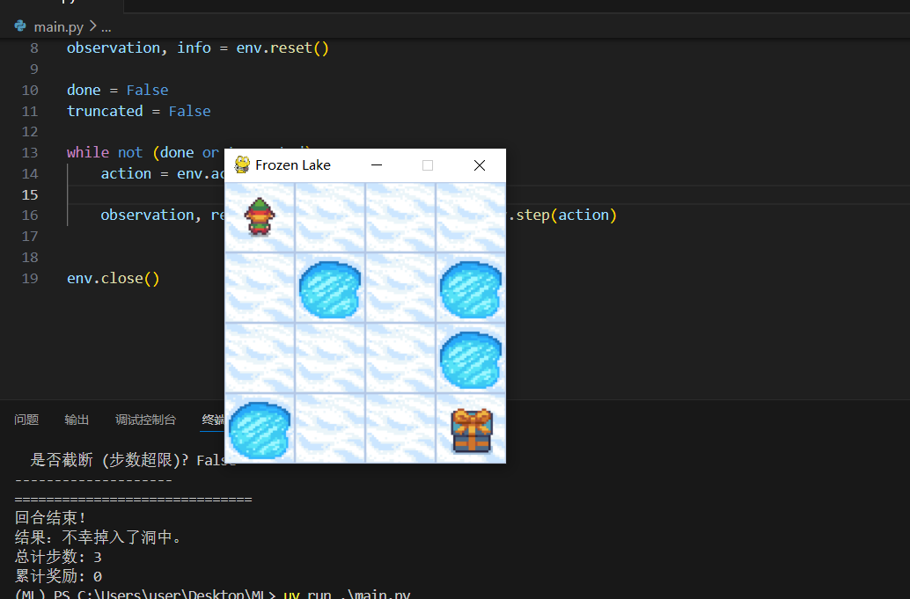

以gym中的FrozenLake为例子。

- 一共16个状态：S0到S15，其中S5, S7, S11, S12为冰洞，S0为起点，S15为重点
- 一共4个动作：上下左右
- 奖励：到终点+1，否则都是0
- 折扣因子(γ)：0.9
- 目标：找到起点到终点的最优策略

### 手动计算

**策略评估**

首先初始化一个策略$\pi_0$，上下左右选择的概率均为25%。接下来计算贝尔曼期望方程，以S0为例：

$$
V_{\pi_0}(S0) = 0.25 \times [R(\text{上}) + 0.9 \times 0] + 0.25 \times [R(\text{下}) + 0.9 \times V_{\pi_0}(S4)] + 0.25 \times [R(\text{左}) + 0.9 \times 0] + 0.25 \times [R(\text{右}) + 0.9 \times V_{\pi_0}(S1)]
$$

超出范围直接为0，然后是V(S1)：

$$
V_{\pi_0}(S1) = 0.25 \times [R(\text{上}) + 0.9 \times 0] + 0.25 \times [R(\text{下}) + 0.9 \times V_{\pi_0}(S5)] + 0.25 \times [R(\text{左}) + 0.9 \times V_{\pi_0}(S0)] + 0.25 \times [R(\text{右}) + 0.9 \times V_{\pi_0}(S2)]
$$

然后我们就得到了V(S1)的回报，依此类推我们能得到16个方程，其中冰洞处直接为0，最终就能联立方程组解出所有的V。这样子我们就得到了策略$\pi_0$的评估。

**策略改进**

$$
Q_{\pi_0}(S) = R(S, a) + 0.9 \times V_{\pi_0}(S')
$$

动作价值Q的思想：当前奖励加上原先的下一个状态原先之前的策略的回报。用这个公式在遍历所有的状态和所有的动作，就能求出最大的策略。然后我们得到了一个新的策略，然后根据新的策略又继续联立16个方程组，训练这个过程，最终就能求出最优策略。

### 问题

上面是联立了16个方程，如何遇到很多很多方程的情况下怎么办？我们需要把贝尔曼期望方程改成迭代的形式：

$$
V_{\pi}(s) = \sum_a \pi(a|s) \times \sum_{s'} P(s'|s, a) \times [R(s, a, s') + \gamma \times V_{\pi}(s')]
$$

这就是贝尔曼期望方程了。

$$
V_{k+1}(s) \leftarrow \sum_a \pi(a|s) \times \sum_{s'} P(s'|s, a) \times [R(s, a, s') + \gamma \times V_k(s')]
$$

其中：
- $V_k(s)$ 是第 k 轮迭代时对状态 s 价值的估计
- $V_{k+1}(s)$ 是根据第 k 轮的估值计算出的新一轮估计

改成迭代后，我们即可从初始值不断去逼近原先方程的解。计算过程中将初始值全部设计成0，然后反复迭代。当变化量很小时说明是收敛的。

能写成迭代的原因是，本身就是一个不动点问题，初值可以设置成0，因为有折扣因子的存在，无论设置成什么最终都会由"压缩映射"原理趋向收敛。这样子我们就解决了超大线性方程组难以求解的问题。

## 代码实现

### 策略评估

寻找最优策略之前实际上不需要和游戏交互，所以直接开始迭代即可。

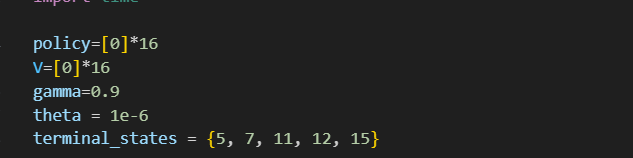

首先初始化一个策略 `policy = [0]*****16`，也就是无论在哪都往一个方向走，然后初始化 `V = [0]*****16`，也就是每一个状态下所能获得到的回报。

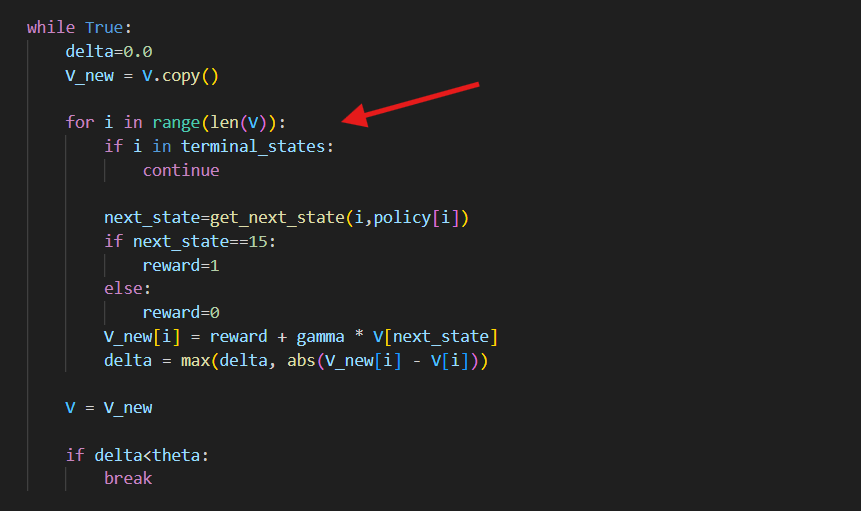

接下来开始迭代，首先遍历所有的状态。获取当前的状态和当前状态下的动作，得到下一个状态和奖励，只有走到终点奖励+1否则都是0。然后计算当前状态的回报：`V[current] = reward + gamma * V[next_state]`。不断这样遍历所有，直到变化 `delta` 小于 1e-6，然后结束整个V的求解，说明其收敛。掉到冰洞里面不纳入计算，因为没有下一个状态了。

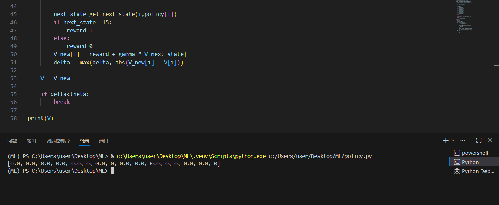

运行后会发现是全0，因为现在是往左走，这个无论如何都走不到终点，所有这个策略拿不到任何回报。

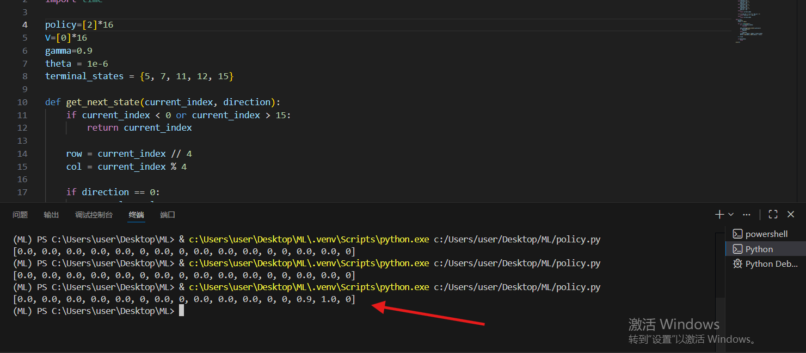

如果改成往右走就能看到出现回报了，并且还能看到衰减因子的作用。

### 策略改进

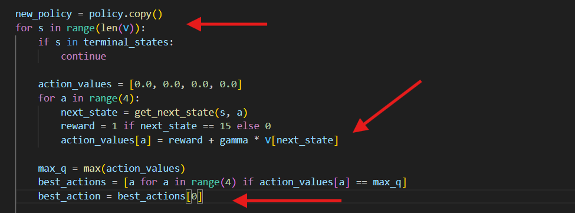

使用动作价值函数，不断的改进所有状态中的策略。

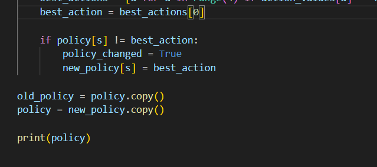

然后更新策略。

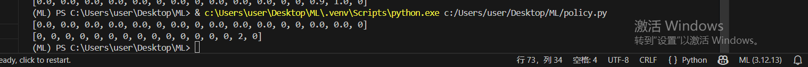

运行后可以发现，在14的位置，也就是终点的左边往右走能获得更高的奖励，这个时候我们再次去评估新的策略。

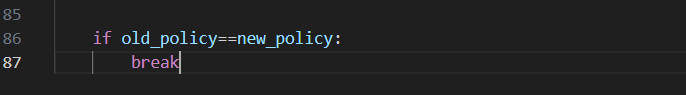

当新老策略一样的时候说明找到最优的了。

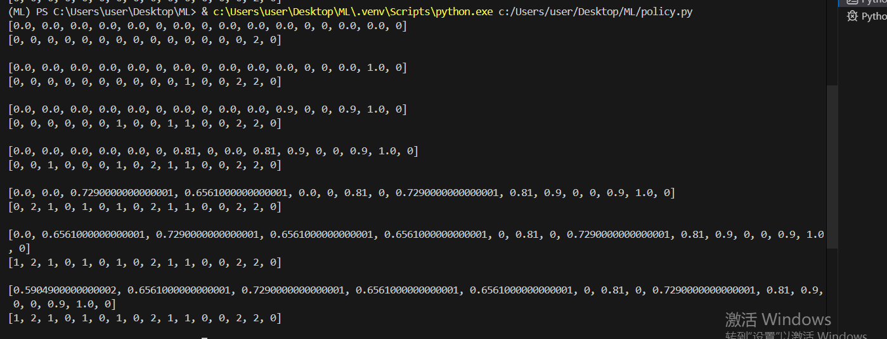

如上就是最终的策略了，看看能不能用这个策略成功通关。

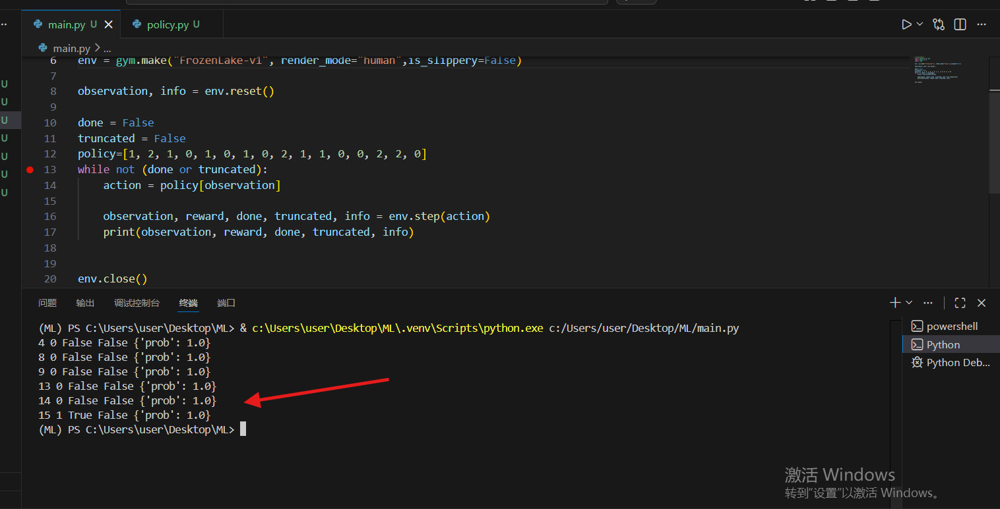

完全可以通关了，已经能走到终点了

# 值迭代

值迭代和策略迭代是两兄弟，其核心思想是直接迭代更新最优价值函数 $V^{\ast}(s)$，一旦 $V^{\ast}$ 收敛就是最优策略了。

$$
Q^{\ast}(\text{晴天}, \text{打伞}) = R(\text{晴天}, \text{打伞}) + 0.9 \times \max_a Q^{\ast}(\text{晴天}, a)
$$

值迭代省略掉了策略迭代的"评估-改进"，直接采用贝尔曼最优方程。当前的奖励加上未来所有能获得的最大奖励，通过不断的遍历状态空间和动作空间一步步的去更新这个。

$$
V_{k+1}(s) = \max_a \{ R(s, a) + \gamma \times V_k(s') \}
$$

但是我们这里会采用Q版本的贝尔曼最优方程，因为Q版本的还会考虑动作，而V版本的直接包含了所有。

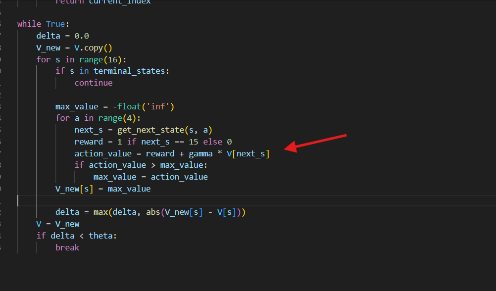

不断的求某一个状态下所有那种选择收益最高。

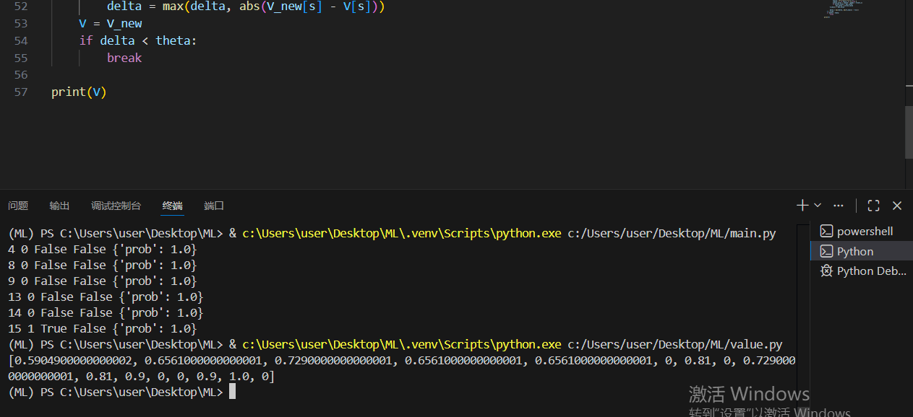

这样子我们最终就知道了所有 $V^{\ast}$，然后我们每次都选择所能获得收益最高的状态走。

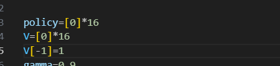

需要把终点设置成1，不然提取最优价值的时候，终点没有参与更新。

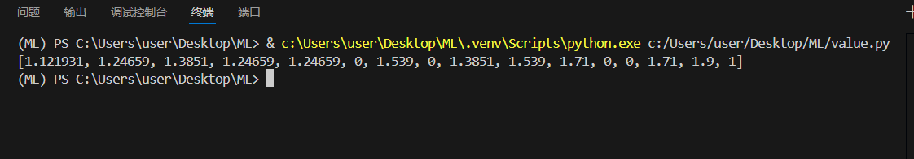

然后我们就得到了每一个状态所能获得到的最大回报：

$$
V^* = \begin{bmatrix}
1.12 & 1.25 & 1.39 & 1.25 \\
1.25 & 0 & 1.54 & 0 \\
1.39 & 1.54 & 1.71 & 0 \\
0 & 1.71 & 1.90 & 1
\end{bmatrix}
$$

写成4x4的地图，接下来我们使用 $Q(s, a)$ 求出每一步最优选择。

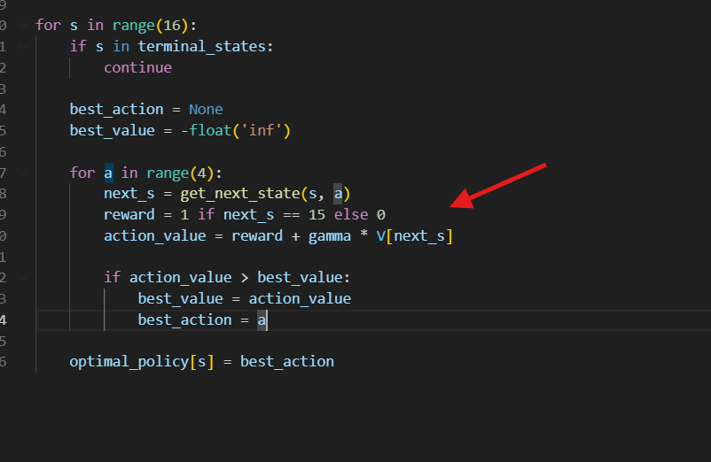

每次都选择最大的，最终得到最优策略。

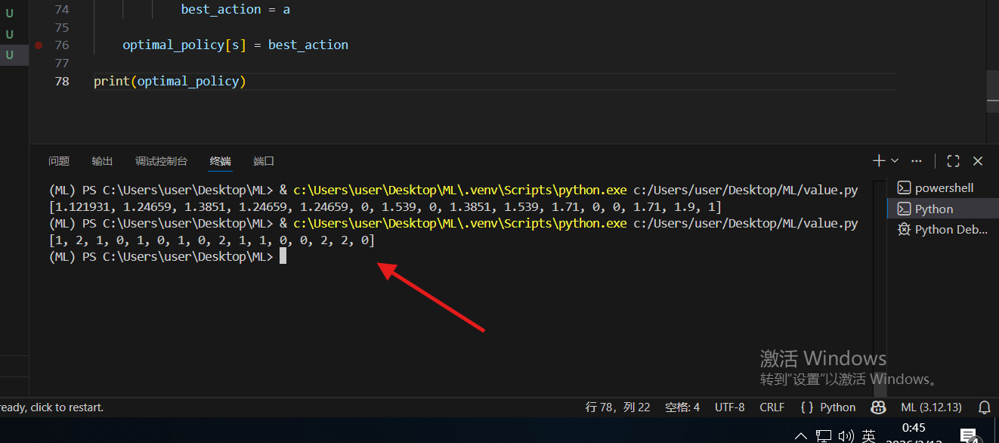

这个结果和之前是一样的，值迭代更加简单容易实现，策略迭代能更快的达到收敛。

# 动态规划

我之前学习DP的时候很不解，只知道动态规划是对递归的裁剪，能够优化递归的方向，裁剪掉无用部分。学了MDP后我发现，上面的策略迭代和值迭代也是动态规划问题的解法。

刷一下力扣的动态规划题。

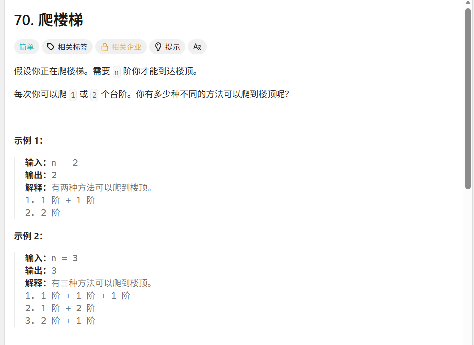

这种比较简单的我就不刷了，要么用递归，或者用一个数组记录下跳到第k和k+1阶有多少种方法，假设为a和b，然后k+2阶就有a+b种，然后就秒了。

## 打家劫舍

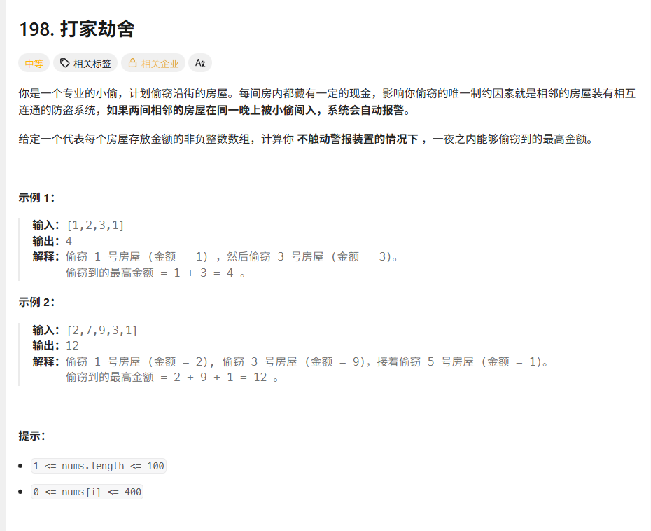

这个我们就能用策略迭代或者值迭代的思路去解了：

- 状态空间：n × 2
- 动作空间：0(偷)、1(不偷)
- 奖励：偷就是金额，不偷就是0，但是存在上一个房子是否被偷的约束
- 状态转移：如果上一个偷了，下一个只能不偷；如果上一个没偷，下一个可偷可不偷

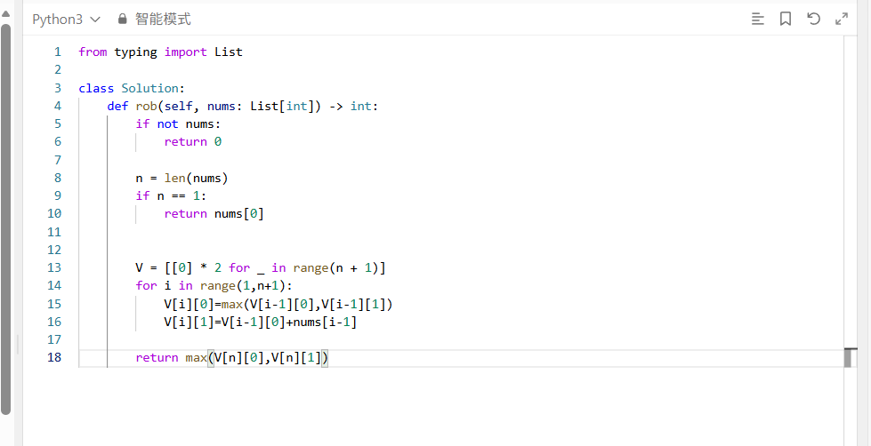

然后这样子就行了，为0意味着没偷，那么当前的最大金额为上一个偷了和没偷的最大值。如果1意味着偷了，当前的金额就是上一个没偷加上奖励。也是值迭代的思想，每次都选择最优的。

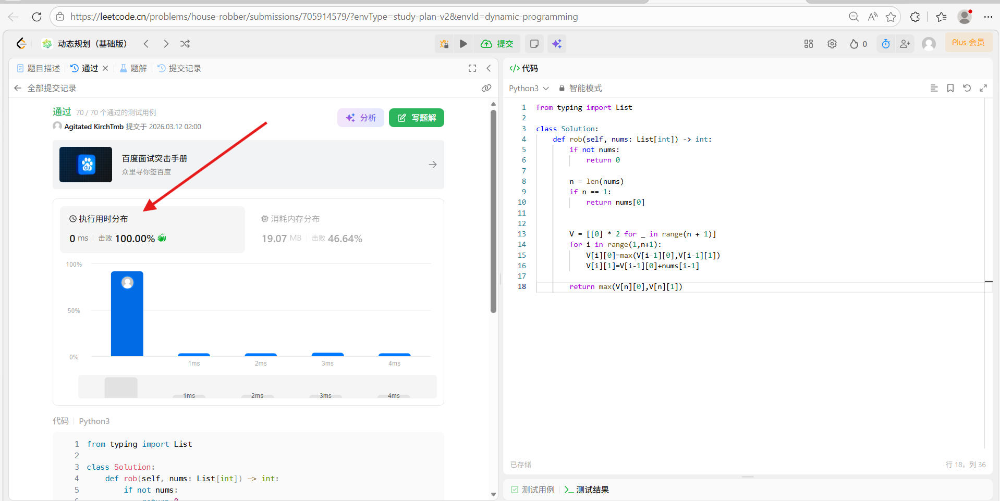

执行用时击败 100%，后面那个内存咱不看。

## 删除并获得点数

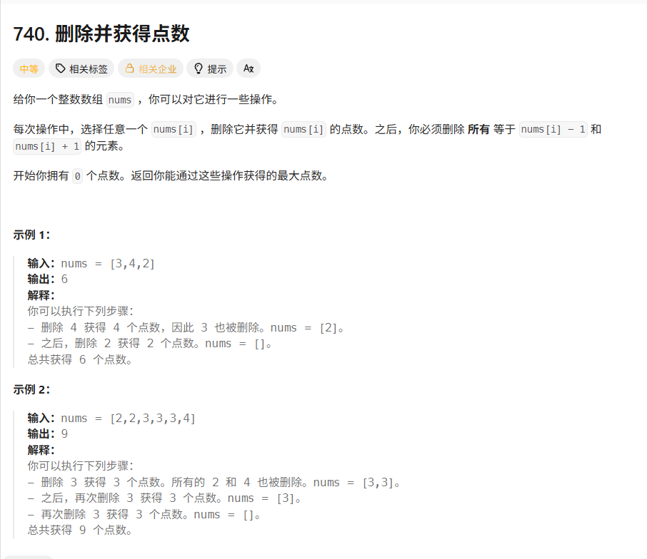

这个的状态转移有点难思考出来。用递归能直接秒了，但是这样就没意思了。

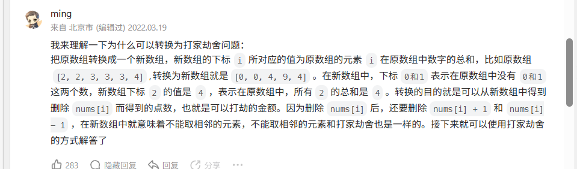

看了别人的解析，醍醐灌顶。

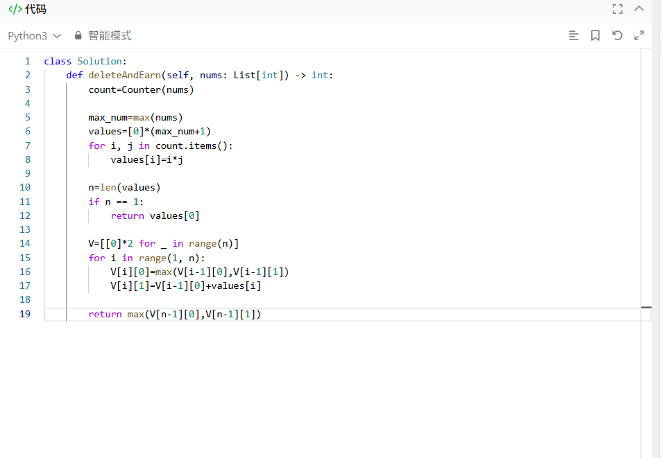

按照他的思路写出代码。

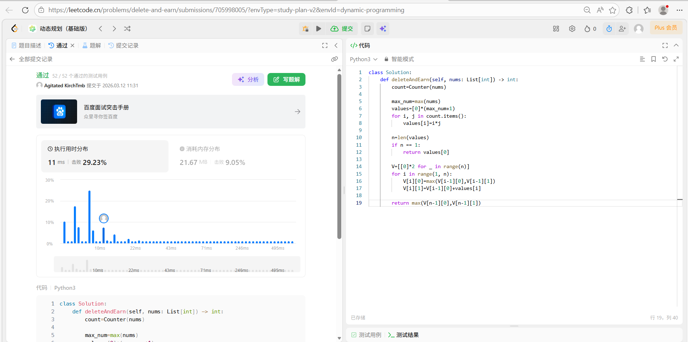

然后通过了。

## 总结

我继续看了几道动态规划的题目，感觉和我想想的强化学习有点区别，更多的还是如何划分子任务，如何从已有的最优状态中继续找到新的最优状态，确实是值迭代的思想，但是有一些题目很难想到如何设计表格，如果不看解析靠自己想可能一道题需要花费大量的时间。

# 蒙特卡洛方法

这个在数值分析中接触过，求积分的时候可能很难求，将积分分成若干个矩形，每一个矩形随机的取点，计算落在曲线下方的概率，然后矩形的面积乘概率就可近似为这一部分积分的值了。

想想好像确实是也能用来求最优策略。

当不知道状态转移概率和奖励函数时则可以尝试使用蒙特卡洛方法寻找最优策略，这种场景叫做无模型（Model-free）。蒙特卡洛（Monte Carlo，MC）方法是强化学习中无模型方法的重要代表。

在上述的核心是求价值函数V，而蒙特卡洛方法本身可以用来近似估计函数值，但如果估计V会无法求出Q，因为不知道P和R无法像值迭代那样从 $V^{\ast}$ 中获取最优策略，所以我们直接使用蒙特卡洛方法来估计Q即可。

$$
G_t = R_{t+1} + \gamma R_{t+2} + \gamma^2 R_{t+3} + \cdots
$$

首先我们需要计算一个完整回合的回报，上面这个 $t$ 是倒数第几步的含义。

$$
Q(s, a) \leftarrow Q(s, a) + \alpha [G - Q(s, a)]
$$

然后更新Q，这个Q是倒着更新的。并且每一个Q只能更新一次。这个Q也是由MDP中的动作价值函数推导出来的，推导过程如下：

$$
Q_\pi(s, a) = \mathbb{E}_\pi[G_t \mid S_t = s, A_t = a]
$$

动作价值函数的另一个解释是遵循策略 $\pi$ 所能获得的期望回报。

$$
Q(s, a) \approx \frac{G_1 + G_2 + \cdots + G_N}{N}
$$

然后使用蒙特卡洛的思路去估计Q，采样N次求均值。

经过推导可得：

$$
Q_n = \frac{G_1 + \cdots + G_{n-1}}{n-1}
$$

进一步简化：

$$
Q_{n+1} = Q_n + \frac{1}{n} (G_n - Q_n)
$$

最后再把 $\frac{1}{n}$ 改成学习率 $\alpha$，就是蒙特卡洛方法中近似估计Q的公式了：

$$
Q(s, a) \leftarrow Q(s, a) + \alpha [G - Q(s, a)]
$$

## 手动计算

同样以FrozenLake为例子：

时间步 t=0: 状态0 → 动作下(1) → 到达状态4, 奖励0
时间步 t=1: 状态4 → 动作下(1) → 到达状态8, 奖励0
时间步 t=2: 状态8 → 动作右(2) → 到达状态9, 奖励0
时间步 t=3: 状态9 → 动作下(1) → 到达状态13, 奖励0
时间步 t=4: 状态13 → 动作右(2) → 到达状态14, 奖励0
时间步 t=5: 状态14 → 动作右(2) → 到达状态15, 奖励+1

假设这是第一个回合。计算回报：

- $t=5$: $G_5 = 1$
- $t=4$: $G_4 = 0 + 0.9 \times 1 = 0.9$
- $t=3$: $G_3 = 0 + 0.9 \times 0.9 = 0.81$
- $t=2$: $G_2 = 0 + 0.9 \times 0.81 = 0.729$
- $t=1$: $G_1 = 0 + 0.9 \times 0.729 = 0.6561$
- $t=0$: $G_0 = 0 + 0.9 \times 0.6561 = 0.59049$

然后计算Q值，其中0.1是学习率：

- $(s=0, a=1)$: $Q(0,1) = 0 + 0.1 \times 0.59049 = 0.059049$
- $(s=4, a=1)$: $Q(4,1) = 0 + 0.1 \times 0.6561 = 0.06561$
- $(s=8, a=2)$: $Q(8,2) = 0 + 0.1 \times 0.729 = 0.0729$
- $(s=9, a=1)$: $Q(9,1) = 0 + 0.1 \times 0.81 = 0.081$
- $(s=13, a=2)$: $Q(13,2) = 0 + 0.1 \times 0.9 = 0.09$
- $(s=14, a=2)$: $Q(14,2) = 0 + 0.1 \times 1 = 0.1$

原来这是蒙特卡洛方法啊，我一直都想着应该要这样子回传奖励。

## 代码实现

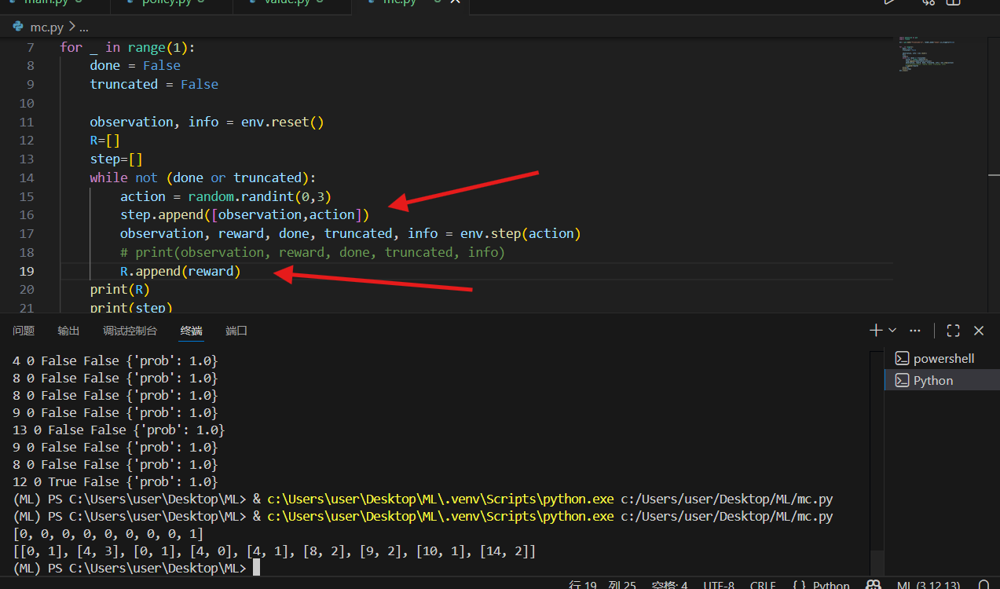

记录下了每一步的状态和奖励，当前是纯随机的。

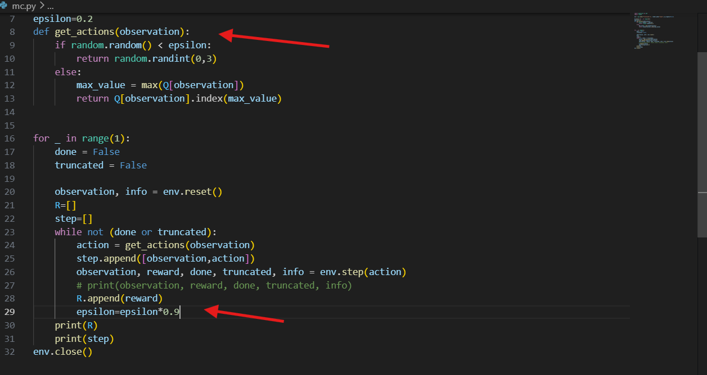

然后加入探索策略。

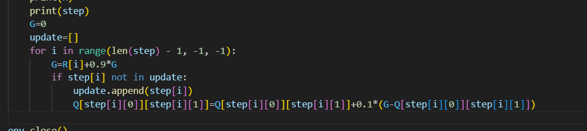

然后不断更新Q，后面发现问题了，我这个不是首次出现的Q(s,a)，我这个是最后一次出现的Q(s,a)，我这样子也能收敛，但是还是希望按照标准改成首次。

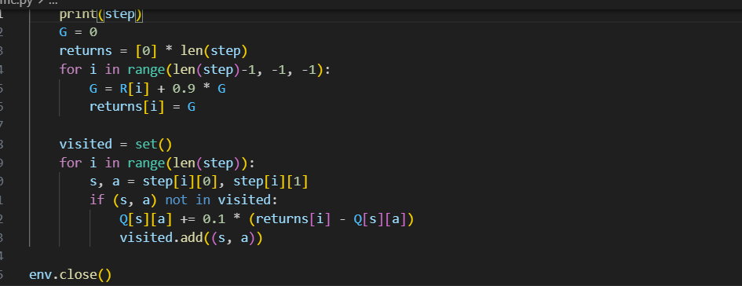

这样子就改成了首次，必须首次或者最后一次的原因是防止出现徘徊的情况重复刷分导致局部最优。

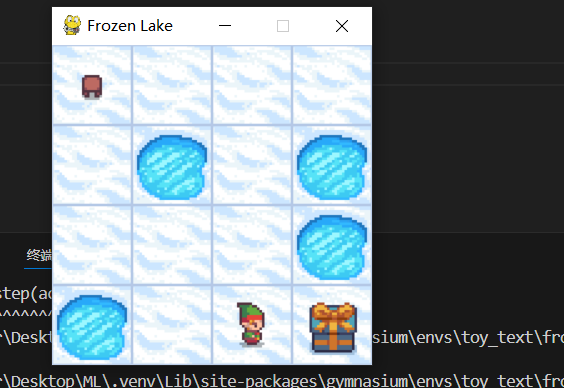

训练大概不到100次找到了最优的路线。

# 时序差分学习

这个我之前在直接编写Qlearning的代码中就遇见过，但是只知其然不知其所以然，有了如上的一步步探索我认为我现在有足够的知识去了解其真正的原理。

在FrozenLake中使用蒙特卡洛方法更新Q时，需要一个完整的回合，才能进行第一次更新，并且单次学习还不够需要下次不断的重复正确的路径，才能很好的回传完整的学习信号。如果单次回合很长那效率会很慢，还会受到随机探索的影响。

$$
G(S0) = R + G(S4)
$$

在如上计算回报G时，需要一次完成的回合才知道。以如上为例，我们想知道G(S0)需要知道G(S4)，同样的知道G(S4)又需要知道下一个状态，需要最终结束才能完整的给出回报。

那现在我们能不能直接近似的去估计G(S4)呢？能的，我们当前有一个Q表，这个Q表中存在 $Q[S4, *]$ 下的每一个动作的值，我们能不能用 $\max(Q[S4])$ 来近似的估计 $G(S4)$?

$$
G_t = R_{t+1} + \gamma \times G_{t+1}
$$

通过回报不断G回传奖励，通过G回报来更新Q最终得到 $Q^{\ast}$，也就是如上两个的公式。

将 $G_t = R_{t+1} + \gamma \times G_{t+1}$ 中的 $G_{t+1}$ 替换为 $\max Q(S_{t+1}, a)$：

$$
G_t = R_{t+1} + \gamma \times \max_a Q(S_{t+1}, a)
$$

替换后得到如上的公式。

展开 $Q(s, a)$ 的公式，最终我们得到一个新的近似估计Q的公式：

$$
Q(S_t, A_t) \leftarrow Q(S_t, A_t) + \alpha \times [(R_{t+1} + \gamma \times \max_a Q(S_{t+1}, a)) - Q(S_t, A_t)]
$$

## 为什么能这样近似？

$$
Q^{\ast}(s, a) = R(s, a) + \gamma \times \max_{a'} Q^{\ast}(s', a')
$$

这个是最优动作价值函数的公式，也就是当前的最优动作价值等于，当前的奖励加上未来的最大动作价值。

我们能尝试不断的去逼近，用最优值减去当前值，得到当前值距离最优值差多少，不断往最优值接近：

$$
Q(s, a) \leftarrow Q(s, a) + \alpha [Q^{\ast}(s, a) - Q(s, a)]
$$

展开 $Q^{\ast}$ 得到：

$$
Q(s, a) \leftarrow Q(s, a) + \alpha [R(s, a) + \gamma \times \max_{a'} Q^{\ast}(s', a') - Q(s, a)]
$$

其中括号里的部分是 **TD误差**，它衡量了新目标与旧估计之间的差距。

意不意外惊不惊喜？这个推导出来的公式和上面那个从蒙特卡洛方法推导出来的公式长得几乎**一模一样**！！！

于是乎我们就完成了从**蒙特卡洛方法**向**时序差分学习**的重大转变，将蒙特卡洛方法中的 $G(s)$ 用 $\max(Q[s])$ 来近似代替。

不过我们还需要回答一个问题，这里的推导用到了最优 $Q^{\ast}$，我们在蒙特卡洛中的公式是没用最优，为什么我们在蒙特卡洛中的公式不借助最优却能一步步逼近最优呢？

因为最优存在于达成目标的那个Q(s,a)中，此时这个就是 $Q^{\ast}$，当我们知道S状态的 $Q^{\ast}$ 时，S的上一个状态就能根据这个 $Q^{\ast}$ 计算出自己的 $Q^{\ast}$，然后不断回传不断回传，让整表都趋近于 $Q^{\ast}$。这样哪怕我们不知道 $Q^{\ast}$ 也能通过**时序差分**不断逼近。

## 最终公式

$$
Q(S_t, A_t) \leftarrow Q(S_t, A_t) + \alpha \times [(R_{t+1} + \gamma \times \max_a Q(S_{t+1}, a)) - Q(S_t, A_t)]
$$

通过如上的推导我们就能得出**时序差分学习**下如何估计 $Q(s, a)$ 的公式了，这也是我在Qlearning中所使用的公式。

## flappy-bird

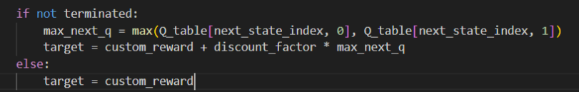

计算下一个状态的 $Q^{\ast}$。

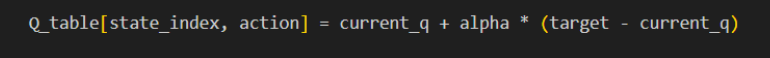

然后更新Q，这就是整个的核心。从QLearning到DQN就是将Q表利用神经网络给近似了。

# 策略梯度方法

在之前的方法都是基于V和Q函数的。这样子会出现两个问题：

1. 如果动作空间非常非常大，例如机器人的动作空间，计算 $\max(Q[s])$ 会变得效率很低
2. 上述方法求的策略都是确定性的，也就是到了一个状态就有一个action，但是有些场景下最优策略可能不是确定的，例如如果训练玩剪刀石头布，用上述的方法，总会得到一个确定性的"最优策略"，但这个游戏最优策略肯定不可能是确定的。

$$
\pi(a \mid s; \theta)
$$

于是策略梯度方法换了一个思路，直接参数化一个策略，并优化这些参数以最大化长期回报。如上的符号代表，在参数为 $\theta$ 的策略下，于状态 $s$ 采取动作 $a$ 的概率。有点像神经网络的权重。

$$
J(\theta) = \mathbb{E}_{\tau \sim \pi_\theta}[G(\tau)] = \mathbb{E}_{\tau \sim \pi_\theta}\left[ \sum_{t=0}^{T} \gamma^t R_{t+1} \right]
$$

目标就变成了找到一组最优参数 $\theta^{\ast}$，使得在该策略下获得的期望总回报（目标函数 $J(\theta)$）最大。

接下来我们需要知道如何调整 $\theta$ 能达到最优，这个时候就需要用到梯度了。我们来一步步推导这个梯度：

$$
J(\theta) = \sum_\tau p(\tau; \theta) \times G(\tau)
$$

其中 $p(\tau; \theta) = p(s_0) \times \prod_{t=0}^{T} [\pi(a_t \mid s_t; \theta) \times p(s_{t+1} \mid s_t, a_t)]$，求导可得：

$$
\nabla_\theta J(\theta) = \sum_\tau [\nabla_\theta p(\tau; \theta)] \times G(\tau)
$$

这里因为是有限的，所以**求导和求和能交换顺序**。

我们还需要一个恒等式，叫做**对数-导数技巧**（log-derivative trick）：

$$
\nabla_\theta \ln p(\tau; \theta) = \frac{1}{p(\tau; \theta)} \nabla_\theta p(\tau; \theta)
$$

带入公式可得：

$$
\nabla_\theta J(\theta) = \sum_\tau p(\tau; \theta) \times [\nabla_\theta \ln p(\tau; \theta)] \times G(\tau)
$$

进一步展开：

$$
\ln p(\tau; \theta) = \ln p(s_0) + \sum_{t=0}^{T} [\ln \pi(a_t \mid s_t; \theta) + \ln p(s_{t+1} \mid s_t, a_t)]
$$

对 $\theta$ 求导，常数项不要了：

$$
\nabla_\theta \ln p(\tau; \theta) = \sum_{t=0}^{T} \nabla_\theta \ln \pi(a_t \mid s_t; \theta)
$$

最终得到梯度的公式：

$$
\nabla_\theta J(\theta) = \sum_\tau p(\tau; \theta) \times \left[ \sum_{t=0}^{T} \nabla_\theta \ln \pi(a_t \mid s_t; \theta) \right] \times G(\tau)
$$

其中只要知道策略 $\pi$ 的梯度，就能算整个梯度了。

## REINFORCE

$$
\theta \leftarrow \theta + \alpha \sum_t [\nabla \ln \pi(a_t \mid s_t; \theta) \times G_t]
$$

用策略 $\pi_\theta$ 生成轨迹 $\tau$，计算每个时间步的回报 $G_t$，最后用如上的方式更新参数，这就是整个REINFORCE的原理了。这里和神经网络梯度的区别是，一个要最小化损失函数，一个需要最大化状态价值函数。

这个算法看起来还是像是蒙特卡洛方法的改进。

## FrozenLake

我们还是以FrozenLake为例子，手动计算实现REINFORCE算法。

我们需要初始化一个参数矩阵 $\theta$，这是 $16 \times 4$ 的矩阵，每一行代表一个状态，每一列代表动作，例如 $\theta_{0,0}$ 就是在S0下选择第一个动作的权重。

$$
\pi(a \mid s; \theta) = \frac{e^{\theta_{s,a}}}{\sum_{b=0}^{3} e^{\theta_{s,b}}}
$$

我们要计算一个状态下选择哪一个策略则是通过如上的公式，这个公式是Softmax函数。我们先让 $\theta$ 矩阵初始化为0。

假设有如下的一次轨迹（s0=0 动作=下 r1=0 s1=4 → s2=8 → s3=9 → s4=13 → s5=14 → s6=15终止），我们根据这个轨迹算回报：

$$
\begin{aligned}
t=5:&\ G_5 = r_6 = 1 \\
t=4:&\ G_4 = r_5 + \gamma G_5 = 0 + 0.9 \times 1 = 0.9 \\
t=3:&\ G_3 = r_4 + \gamma G_4 = 0 + 0.9 \times 0.9 = 0.81 \\
t=2:&\ G_2 = r_3 + \gamma G_3 = 0 + 0.9 \times 0.81 = 0.729 \\
t=1:&\ G_1 = r_2 + \gamma G_2 = 0 + 0.9 \times 0.729 = 0.6561 \\
t=0:&\ G_0 = r_1 + \gamma G_1 = 0 + 0.9 \times 0.6561 = 0.59049
\end{aligned}
$$

接下来我们需要求 $\theta$ 梯度：

当 $a = a_t$ 时：

$$
\frac{\partial}{\partial \theta_{s, a_t}} \ln \pi(a_t \mid s; \theta) = 1 - \pi(a_t \mid s; \theta)
$$

当 $a \neq a_t$ 时：

$$
\frac{\partial}{\partial \theta_{s, a}} \ln \pi(a_t \mid s; \theta) = -\pi(a \mid s; \theta)
$$

最终合并得到：

$$
\nabla_{\theta_{s,a}} \ln \pi(a_t \mid s; \theta) =
\begin{cases}
1 - \pi(a \mid s; \theta), & a = a_t \\
-\pi(a \mid s; \theta), & a \neq a_t
\end{cases}
$$

然后依次计算梯度：

- $\nabla_{\theta_0} \ln \pi(1 \mid 0; \theta) = [-0.25, 0.75, -0.25, -0.25]^T$
- $\nabla_{\theta_4} \ln \pi(1 \mid 4; \theta) = [-0.25, 0.75, -0.25, -0.25]^T$
- 等等...

接下来我们再使用公式更新 $\theta$ 矩阵，假设 $\alpha = 0.1$：

- $\Delta\theta_0 \approx [-0.01476, 0.04429, -0.01476, -0.01476]^T$
- $\Delta\theta_4 \approx [-0.01640, 0.04921, -0.01640, -0.01640]^T$

然后更新参数，例如 $\theta'_{0,1} = 0 + 0.04429 = 0.04429$，$\theta'_{14,2} = 0 + 0.075 = 0.075$。

## 代码实现

还是以FrozenLake为例子实现一个REINFORCE算法，其实和上面蒙特卡洛的过程有很多相似之处，一个更新的是Q一个更新的是 $\theta$，$\theta$ 使用梯度进行更新。

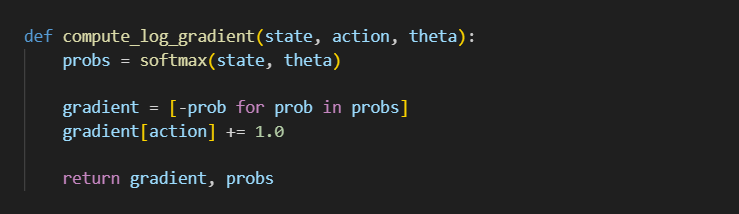

核心就是这个求梯度。

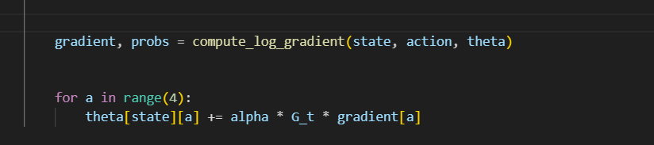

然后不断更新 $\theta$ 的过程，其中G的计算和蒙特卡洛一样，我就不赘述了。我实际测试发现训练效果其实很差，但是这个思想很像神经网络的感觉。

# 演员-评论员方法

在上面的REINFORCE算法中，收敛效果很差，应该引入基线的概念：

$$
\theta \leftarrow \theta + \alpha \sum_t [\nabla \ln \pi(a_t \mid s_t; \theta) \times (G_t - V(s_t))]
$$

原先的公式就可以变成这样子，将状态价值函数作为基线，降低每次更新的方差。问题来了，我们怎么能计算这个 $V(s_t)$？

可以通过学习一个价值函数来估计它。这个负责评估状态/动作价值的"评委"，就是**评论员**。而原来负责选择动作的策略，就是**演员**。由此就引出了**演员-评论员**框架。

- 演员：一个参数化的策略 $\pi(a \mid s, \theta)$
- 评论员：一个参数化的价值函数 $V(s, w)$

演员部分和上文中的策略梯度方法所讲述的思想基本不变，我们需要重点介绍引入的评论员概念，从状态价值函数一步步推导，如何采用类似反向传播的方式更新 $V(s, w)$。

原先的状态价值函数公式，假设 $\pi$ 是最优策略：

$$
V_\pi(s) = \mathbb{E}_\pi G_t
$$

在理想的条件下我们参数化后：

$$
V_\pi(s) = V(s, w)
$$

左边就是真实值，右边就是预测值，但是几乎不可能做到完全的相等，就会出现损失了：

$$
\text{loss} = V_\pi(s) - V(s, w) = \mathbb{E}_\pi[R_{t+1} + \gamma V_\pi(S_{t+1})] - V(s, w)
$$

理想的损失函数就长这样子了，但是无模型的情况下我们根本不知道P也就无法求期望，所以上面这个理想的损失函数无法使用。

我们将回报G展开，能得到一个递推的公式：

$$
V_\pi(s) = \mathbb{E}_\pi[R_{t+1} + \gamma V_\pi(S_{t+1})]
$$

我们回顾时序差分学习中，利用 $\max(Q[S4])$ 来近似代替 $G(S4)$，我们是否能有类似的方法接近无法计算期望的问题呢？

展开求期望：

$$
\mathbb{E}_\pi[R_{t+1} + \gamma V_\pi(S_{t+1})] = \sum_a \pi(a \mid s_t) \sum_{s'} P(s' \mid s_t, a) [R(s_t, a, s') + \gamma V_\pi(s')]
$$

我们再继续展开求期望，其中的P是未知，这是我们主要的难点。

假设我们和环境交互了一次拿到了观测值：

$$
G^{(1)}_t = r_{t+1} + \gamma V_\pi(s_{t+1})
$$

我们重复足够多的次数进行这样的观测，最终取平均就是对原公式的估计：

$$
\mathbb{E}_\pi[R + \gamma V_\pi(S')] \approx \frac{1}{N} \sum_{i=1}^{N} G_t^{(i)}
$$

于是乎我们有这样子的一个式子：

$$
V(s, w) = \frac{1}{N} \sum_{i=1}^{N} G_t^{(i)}
$$

再进一步我们就有了这个式子，左边是预测值，右边接近真实值。

继续展开公式，理论上这应该等于0，但是不太可能，真实值和预测值总会存在误差：

$$
\sum_{i=1}^{N} [r_{i+1} + \gamma V_\pi(s_{i+1}) - V(s, w)] = 0
$$

于是我们把这个定义为损失值：

$$
\text{loss} = r_{i+1} + \gamma V_\pi(s_{i+1}) - V(s, w)
$$

这样子原先的差值就会越来越小。

将上面的推导一步步拆开来看：

- 目标值 (Target): $\text{target}_t = r_{t+1} + \gamma V_\pi(s_{t+1})$
- 预测值 (Prediction): $V(s_t; w)$
- 误差 (Error): $\delta_t^{\text{true}} = \text{target}_t - V(s_t; w)$

最终我们得到如上的损失函数：

$$
L_t(w) = \frac{1}{2} [r_{t+1} + \gamma V_\pi(s_{t+1}) - V(s_t; w)]^2
$$

但是 $V_\pi(s_{t+1})$ 依然未知。

那我们能不能把 $V_\pi(s_{t+1})$ 改成 $V_\pi(s_{t+1}; w)$ 呢？

$$
L_t(w) = \frac{1}{2} [r_{t+1} + \gamma V_\pi(s_{t+1}; w) - V(s_t; w)]^2
$$

我感觉是不能，但是真的公式就是这样的，我不理解如果用预测值的下一个预测值作为损失，最终会收敛到什么？最终会使得相邻状态的值越来越接近。相邻状态的值越来越接近能说明什么？

## 为什么能用预测值和下一个状态预测值作为损失？

看起来很像是循环论证，但是实际上不是的：

$$
V_\pi(s) = \mathbb{E}_\pi[R_{t+1} + \gamma V_\pi(S_{t+1})]
$$

回顾这个状态价值函数，这是一个不动点方程，也就是说他本来不断迭代下去 $V_\pi(s)$ 和 $V_\pi(s+1)$ 就会越来越"接近"，如果所有的状态价值函数都相互"接近"，那就说明这个贝尔曼期望方程收敛了。其中的接近不是数值上的接近，更像是不动点的接近。

## 梯度下降

有了上面的推导过程剩下的就很简单了：

$$
\nabla_w L_t(w) = \delta_t \times [\gamma \nabla_w V(s_{t+1}; w) - \nabla_w V(s_t; w)]
$$

高中数学的链式法则的求梯度过程我就不写了：

$$
w \leftarrow w - \alpha \times \nabla_w L_t(w)
$$

其中 $\alpha$ 是学习率，这样子就完成了对梯度的更新。

但是该算法采用半梯度更新的方式，忽略 $\nabla_w V(s_{t+1}; w)$ 这一项：

$$
w \leftarrow w + \alpha \times \delta_t \times \nabla_w V(s_t; w)
$$

这样子我们就完成了评论员的公式推导了。

## 手动计算

还是以FrozenLake为例子，手动计算整个过程。核心公式如下：

- 评论员：$w \leftarrow w + \alpha_w \times \delta \times \nabla_w V(s; w)$
- 演员：$\theta \leftarrow \theta + \alpha_\theta \times \delta \times \nabla_\theta \ln \pi(a \mid s; \theta)$
- TD误差：$\delta = r + \gamma V(s'; w) - V(s; w)$

评论员设置比较简单：$V(s; w) = w[s]$

它的梯度就会很好计算，实际中会使用神经网络，输入16维向量输出一个值。

演员使用线性Softmax策略，初始化一个 $\theta$ 矩阵。采集的轨迹和之前一样。

计算TD误差：

$$
\delta_0 = r_1 + \gamma \times V(s_1; w) - V(s_0; w) = 0 + 0.9 \times 0 - 0 = 0
$$

然后更新评论家：$w[0] \leftarrow w[0] + 0.1 \times 0 \times 1 = 0$

然后和REINFORCE中相似了：

$$
\theta_{0,1} \leftarrow \theta_{0,1} + 0.1 \times 0 \times 0.75 = 0
$$

然后更新 $\theta$，这一步就是之前的REINFORCE了，然后依次更新完所有的步骤，不断循环这个过程，就是整个演员-评论员方法了。这个算法已经很接近现代的强化学习算法了，很多算法的原理也是基于此并加以改进。

# 总结

还是很有成就感的，学习的过程中经常会遇到看不懂他为什么能这样近似的情况，我还是坚持着一步步的推导，当理解了贝尔曼方程的思想以后，发现很多东西都能慢慢理解出来。

比较开心的是，在演员-评论家方法中，我自己也推导出来了整个公式和过程（应该是对的），感觉更多的不是难以理解，而是没有一个递进式的过程。

在学习强化学习的过程中，我发现有些公式貌似不像是理论推导出来的，而是经验试出来的，然后再补充上的理论，这种感觉在我看神经网络的时候尤其明显，很多的东西很多的架构根本没有什么道理，就是试着就试出来了，然后根据试出来的步骤讲一个故事。
